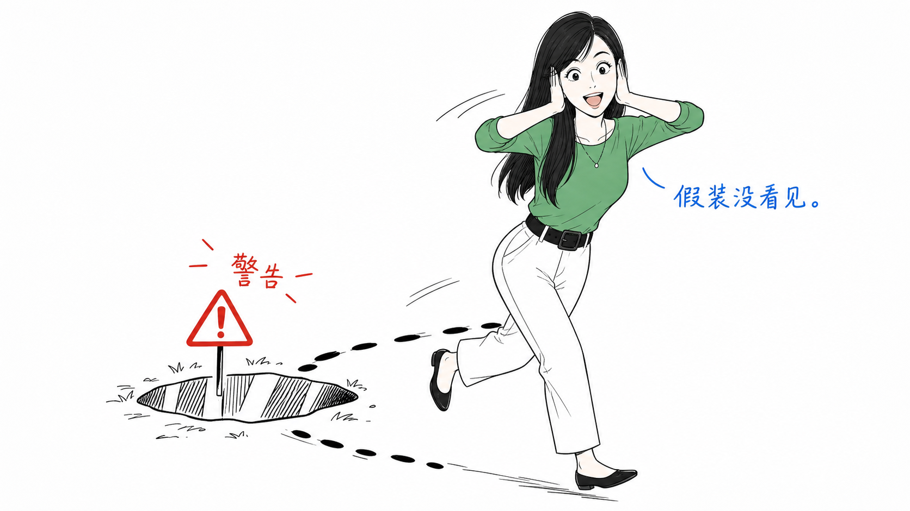
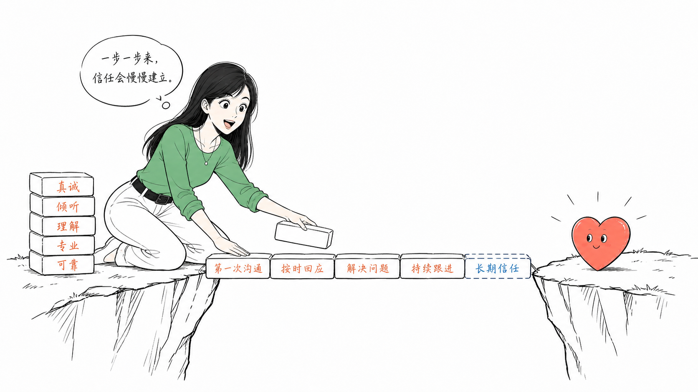
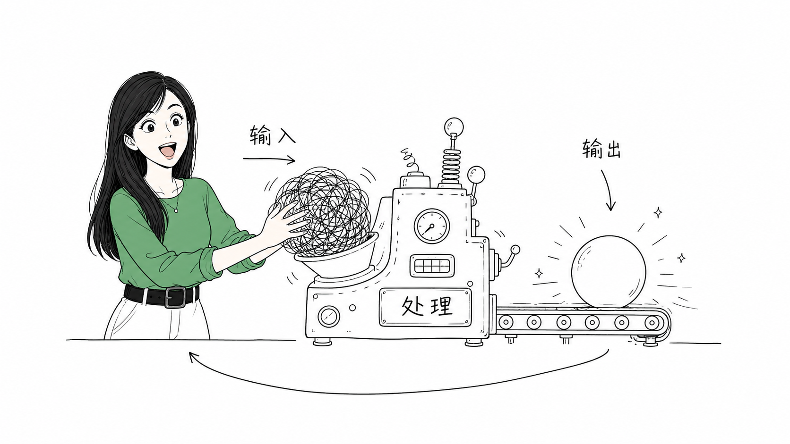

# 🎨 仓老师怪诞正文配图

> 把文章里的关键判断、流程、结构、状态或隐喻，变成一张清爽、怪诞、有创意、可读但不说明书的手绘解释图。

---

## 一句话介绍

**纯白 · 极简 · 手绘 · 留白 · 怪诞 · 有仓老师**

这不是商业插画，不是 PPT 信息图，不是可爱卡通。它更像一个长期做 AI、产品、设计的人，在白纸上随手画出来的一张解释草图——有结构、有隐喻、有情绪，但绝不说明书。

---

## ✨ 核心特色

| 特色 | 说明 |
|------|------|
| **16:9 横版正文配图** | 专为中文文章、博客、文档设计 |
| **2.35:1 公众号封面模式** | 消息列表封面专用：大字标题 + 头像分身 + 方形安全区 |
| **纯白背景** | 无米色、无纹理、无渐变、无阴影 |
| **黑色手绘线稿** | 细线、轻微抖动、不机械、不矢量 |
| **大量留白** | 主体占画面 40%-60%，至少 35% 空白 |
| **仓老师 IP** | 固定视觉角色，必须参与核心动作，不是装饰 |
| **克制用色** | 橙（路径）、红（重点）、蓝（补充），彩色面积 < 10% |
| **中文手写批注** | 每图 5-8 处，每处 2-8 个字 |
| **原创隐喻** | 每次从文章重新发明，不复刻旧构图 |

---

## 👩‍🏫 仓老师是谁

仓老师是本 skill 的固定视觉 IP——一位手绘风格化的年轻女性，长直发、侧分刘海、大眼睛、表情夸张、手势丰富。

她不是吉祥物，不是贴纸，不是可爱装饰。她是**正在认真参与系统运转的荒诞工作者**：铺砖搭桥、绕开警告坑、把毛线团塞进怪机器……表情永远比动作更抢戏。

**关键原则**：如果去掉仓老师，图的核心隐喻还能完全成立，说明她太装饰了；重写提示词，让她成为动作主体。

---

## 📁 仓库结构

```
Cang/
├── SKILL.md                          # 主技能文档：工作流、输出口径
├── agents/
│   └── openai.yaml                   # AI Agent 接口配置
├── scripts/
│   └── validate-package.py           # 发布前自检脚本
├── references/                       # 参考文档（按需要读取）
│   ├── style-dna.md                  # 风格 DNA、颜色、文字、禁忌
│   ├── cang-ip.md                    # 仓老师 IP 形象、性格、动作库（含封面模式覆盖规则）
│   ├── composition-patterns.md       # 结构类型、原创隐喻方法
│   ├── prompt-template.md            # 单张生图提示词模板（含封面模式模板）
│   └── qa-checklist.md               # 生成后检查和迭代规则（含封面追加检查）
├── examples/
│   └── prompts.md                    # 可直接复制使用的调用示例
└── assets/
    ├── avatar-reference.jpg          # 封面模式固定头像身份参考（品牌绿上衣）
    └── examples/                     # 示例图库（风格校准用，品牌绿统一后的版本）
        ├── covers/                   # 封面模式基准图（2.35:1）
        │   ├── cover.jpg              # 主基准图
        │   └── Cang-5.png             # 备选变体
        ├── Cang-1.png                # 常见坑：假装没看见
        ├── Cang-2.png                # 状态变化：焦虑到笃定 + 目标路径
        ├── Cang-3.png                # 信任之桥：一块砖一块铺
        ├── Cang-4.png                # 顿悟：混沌到看懂了
        ├── Cang-6.png                # 顿悟 v2：双气泡对照
        ├── Cang-7.png                # 输入输出：处理机器
        └── Cang-8.png                # 输入/处理/输出三段式
```

---

## 🖼️ 示例展示

### 常见坑 · 假装没看见



> 警告坑就在脚边，仓老师捂耳绕道小跑而过，蓝色批注"假装没看见"点破心态。

### 状态变化 · 焦虑到笃定


> 左：托腮被"想太多""没头绪"的乱线包围。右：比心确认，橙色路径写清四步落地动作。

### 信任之桥 · 一块砖一块铺



> 仓老师跪地铺砖，每块砖写一个动作节点，对岸只有一颗小红心，没有"信任"大标题。

### 顿悟 · 混沌到看懂了


> 头顶乱线团变成发光灯泡，箭头甩出一条清晰路径——"看懂了"三个字收尾。

### 输入输出闭环



> 一团毛线塞进"处理"机器，另一端滚出发光球。仓老师笑着确认。

> 完整图库还有顿悟 v2（`Cang-6.png`）、输入/处理/输出三段式（`Cang-8.png`）等变体，见 `assets/examples/`；封面模式的两张基准图在 `assets/examples/covers/`。

### 公众号封面（2.35:1）


> 左侧大字标题 + 红色补充信息，橙色线牵出核心隐喻小物件；右侧仓老师半身，品牌绿上衣，指向标题确认。

---

## 📱 公众号封面模式

当用户要求"公众号封面""公众号头图""消息列表封面""2.35:1 配图"时，切换到封面模式，不沿用正文插图的 16:9 约束：

- **画布**：精确 **2.35:1**（消息列表封面），保存为 `assets/<article-slug>/00-cover.png`
- **默认构图**：左侧约 55%-60% 留给大字手写主标题（≤14 字），右侧仓老师头像分身 + 一个能表达文章核心的荒诞动作；补充信息 ≤12 字
- **用色**：白底、黑色粗细混合手绘线、红色补充信息、橙色指向线；头像分身上衣固定为品牌绿 `#69b076`
- **参考图**：若 workspace 中存在 `assets/avatar-reference.jpg`，将其作为头像身份参考；不存在时使用提示词中的文字约束，不阻塞生成。已有参考封面可作为第二张构图参考（例如 `assets/examples/covers/`）。
- **头像裁切**：胸部以上到腰部的半身即可，不套用正文插图的"全身入镜"要求
- **方形安全区**：封面转发到对话/朋友圈时会按接近正方形裁切（居中正方形，边长 = 画布高度）。主标题核心字、头像分身、核心隐喻尽量落在居中正方形内；正方形以外只放留白、指向线尾巴等延展性内容，不承载关键信息

> 方形安全区是尽力而为的约束：构图冲突时优先保证 2.35:1 整图的可读性与美感。

---

## 🚀 使用方法

### 发布前自检

在仓库根目录运行：

```bash
python3 cang-skill/scripts/validate-package.py
```

它会检查必需文件、参考文档链接、封面输出路径，以及头像参考图规则是否与主技能同步。

### 作为 AI Skill 调用

在支持 skill 调用的环境中，直接引用：

```
Use $cang-skill to 为这篇中文文章设计并生成几张仓老师怪诞正文配图。
```

### 手动使用提示词模板

如果没有生图工具，按 [`references/prompt-template.md`](references/prompt-template.md) 输出完整提示词，粘贴到外部生图工具使用。

### 工作流

1. **消化正文** → 提炼核心观点、认知转折、适合配图的位置
2. **出配图策略** → 给 shot list（4-8 张，每张明确主题/结构/仓老师动作）
3. **单张生成** → 每张单独生成，16:9，纯白背景，仓老师核心动作
4. **检查迭代** → 对照 [`references/qa-checklist.md`](references/qa-checklist.md) 检查（封面模式额外检查：2.35:1 像素比例、居中方形安全区）
5. **保存交付** → 同一篇文章共用 `assets/<article-slug>/` 目录：封面命名 `00-cover.png`，正文配图从 `01-topic-name.png`、`02-topic-name.png` 开始

---

## 🎨 风格 DNA（一句话）

> **纯白、极简、手绘、留白、克制、怪诞、产品草图感、中文手写感、结构清楚但不说明书。**

### 颜色规范

| 颜色 | 用途 |
|------|------|
| ⚫ 黑色 | 主体线稿、角色、结构、主要文字 |
| 🟠 橙色 | 主流程、路径、箭头、自动化流向 |
| 🔴 红色 | 重点批注、问题、情绪点、关键提醒 |
| 🔵 蓝色 | 补充说明、脑内状态、系统状态 |

### 绝对不要

- ❌ 商业插画 / PPT 信息图 / 正式流程图 / 课程课件
- ❌ 可爱卡通 / 儿童插画 / 复杂架构图 / 精致扁平插画
- ❌ 科技感 UI / 真实 App 截图
- ❌ 复杂背景、渐变、阴影、纹理、纸纹、噪点
- ❌ 左上角写"Workflow 流程图 / 系统架构图"等标题
- ❌ 把每个节点都解释清楚

---

## 📐 密度校准

没有参考图时，按这几条自查：

- **线条总量**：接近一张便签纸随手画的量，不是完整插画
- **主体数量**：核心物件 1-2 个，配件不超过 3 个。宁可空，不要满
- **人物占比**：仓老师占画面高度约 1/3 到 1/2
- **文字总量**：全图中文加起来不超过 40 个字
- **空白**：至少有一块连续空白，大到能再塞下一个主体而不显挤
- **彩色面积**：红/橙/蓝总面积不超过画面 10%

---

## 🔄 反复刻规则

`assets/examples/` 里的图**只用于风格校准**（线条密度、留白、颜色克制、仓老师气质），**不要默认打开或复刻**；`assets/examples/covers/` 是封面模式专用的校准图，规则相同。

除非用户明确说"照这张 / 复刻这个构图"，否则每次都要从当前文章重新发明隐喻。同类主题也要换新隐喻。

> "承接路径"不一定画路线，可以画仓老师把内容尾巴接到门把手；"一鱼多吃"不一定画鱼，可以画仓老师把一个纸团压成几种形状。

---

## 📝 交付标准

高质量图应该让读者先觉得 **"有点怪"**，然后 **1 秒内看懂结构**。

如果第一眼像教程页，而不是白纸上的怪诞产品草图，就不合格。

---

## 📄 License

MIT

---

> *让图自己说话。*
